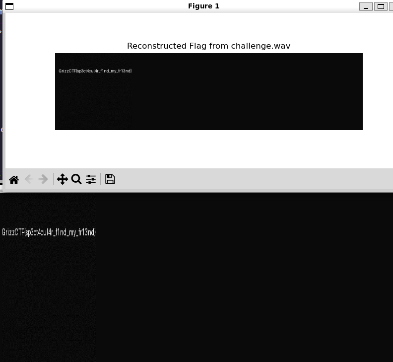

# Spectacular - Writeup
- Author: [supasuge](https://github.com/supasuge) | Evan Pardon
- Category: Forensics/RFz
- Difficulty: Medium
- Points: 250

## Description

There is more tha meet's the eye in audio files, this isn't anything to do with LSB/MSB! Good luck!

### Flag

`GrizzCTF{sp3ct4cul4r_f1nd_my_fr13nd}`


#### Solution

Firstly, we need to convert the byte data into numpy array of int16 samples and compute total samples. 
- According to the .wav genreation, each are 800 rows 800 columns.



I have tried to add comments throught out the code to explain what is happening. If you have any questions, feel free to reach out to me on discord.

##### Solution Source Code

```python
#!/usr/bin/env python3
import numpy as np
import wave
from PIL import Image
import matplotlib.pyplot as plt

# Open the WAV file
wav_filename = 'challenge.wav'
with wave.open(wav_filename, 'rb') as wav:
    n_channels, sampwidth, framerate, n_frames, comptype, compname = wav.getparams()
    frames = wav.readframes(n_frames)
    
# Convert byte data to numpy array of int16 samples
data = np.frombuffer(frames, dtype=np.int16)
total_samples = data.shape[0]

# According to the WAV-generation script:
#   - There were 800 rows (from the BMP image after transpose)
#   - Each row produced an inverse FFT with n=800 samples.
# Hence, total_samples should be 800 * 800 = 640000.
rows = 800
cols = 800
if total_samples != rows * cols:
    raise ValueError(f"Expected {rows*cols} samples, got {total_samples}")

# Reshape the 1D audio data into a 2D array: one row per inverse FFT block
data = data.reshape((rows, cols))

# For each row (which came from irfft), we recover the original frequency-domain coefficients
# by computing the forward real FFT. (Note: irfft and rfft are inverses when proper lengths are used.)
# Here n_fft is 800.
recovered = np.fft.rfft(data, n=cols, axis=1)  # shape: (800, 401)

# Originally, only the first 200 coefficients (per row) were nonzero (the BMP had width 200).
# Extract these and take the real part.
recovered_coeffs = recovered[:, :200].real

# The original process cubed the image values for contrast enhancement.
# We invert that by taking the cube root.
flag_array = np.cbrt(recovered_coeffs)

# The values may not be in the 0–255 range, so scale them accordingly.
flag_array -= flag_array.min()
flag_array /= flag_array.max()
flag_array = (flag_array * 255).astype(np.uint8)

# Finally, undo the initial transpose and column flip.
# The original image was transformed as:
#   img_array = np.array(img, dtype=np.float32).T[:, ::-1]
# So now we reverse: first flip columns back, then transpose.
flag_array = flag_array[:, ::-1]  # flip columns
flag_image = flag_array.T         # transpose to get (height, width) = (200, 800)

# Display the recovered flag using PIL and matplotlib
Image.fromarray(flag_image, mode='L').show()
try:
    plt.figure(figsize=(8, 4))
    plt.imshow(flag_image, cmap='gray')
    plt.title('Reconstructed Flag from challenge.wav')
    plt.axis('off')
    plt.show()
    # save as png
    
except Exception as e:
    print(f"Error displaying the flag: {e}")
```

```bash
GrizzCTF{sp3ct4cul4r_f1nd_my_fr13nd}
```

---
